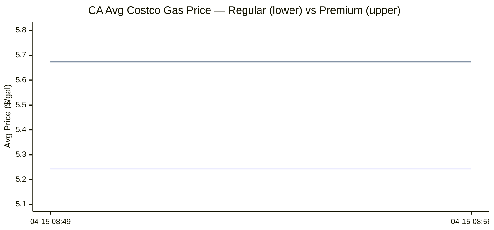
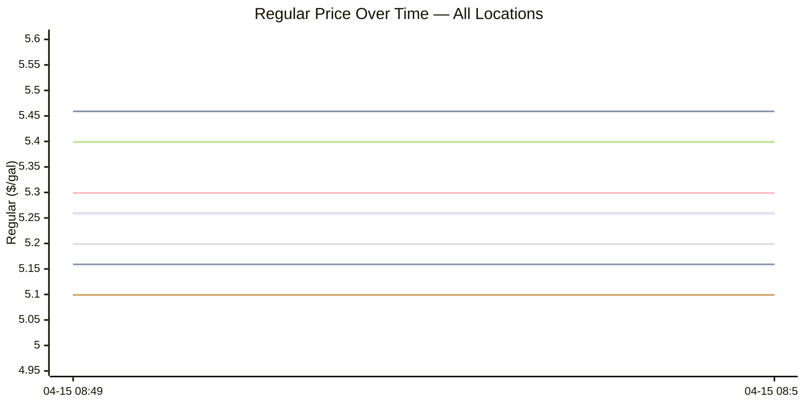

# Costco Gas Prices — California Historical Report

Generated: 2026-04-15 08:56  
Search origin: ZIP 94550 (37.6751, -121.7563)  
Radius: 25 miles  
Locations tracked: 16  
Historical snapshots: 2  
History file: `costco_gas_history.json`

## 1. California Average Over Time

Average Regular and Premium prices across all nearby Costco warehouses at each snapshot.

## 2. Per-Location Historical Pricing (Regular)

Each line represents one Costco warehouse, plotting its Regular price at every snapshot.

**Line legend (in plotting order):**

1. **Livermore**
2. **Pleasanton**
3. **Danville**
4. **Tracy**
5. **Newark**
6. **Fremont**
7. **Hayward**
8. **Hayward Business Center**
9. **Brentwood CA**
10. **NE San Jose**
11. **Antioch**
12. **San Leandro**
13. **Santa Clara**
14. **Sunnyvale**
15. **Concord**
16. **San Jose Business Center**

## Latest Snapshot

Snapshot time: `2026-04-15T08:56`

| # | Location | Distance (mi) | Regular ($) | Premium ($) |
|---|----------|---------------|-------------|-------------|
| 1 | Livermore | 3.6 | 5.399 | 5.799 |
| 2 | Pleasanton | 8.9 | 5.459 | 5.859 |
| 3 | Danville | 13.9 | 5.399 | 5.799 |
| 4 | Tracy | 16.2 | 5.199 | 5.599 |
| 5 | Newark | 16.8 | 5.099 | 5.659 |
| 6 | Fremont | 16.8 | 5.099 | 5.659 |
| 7 | Hayward | 18.7 | 5.159 | 5.559 |
| 8 | Hayward Business Center | 19.0 | 5.299 | 5.699 |
| 9 | Brentwood CA | 19.5 | 5.259 | 5.699 |
| 10 | NE San Jose | 20.9 | 5.199 | 5.599 |
| 11 | Antioch | 23.5 | 5.259 | 5.659 |
| 12 | San Leandro | 23.5 | 5.159 | 5.599 |
| 13 | Santa Clara | 24.1 | 5.199 | 5.599 |
| 14 | Sunnyvale | 24.7 | 5.199 | 5.599 |
| 15 | Concord | 24.7 | 5.399 | 5.799 |
| 16 | San Jose Business Center | 24.8 | 5.099 | 5.599 |
